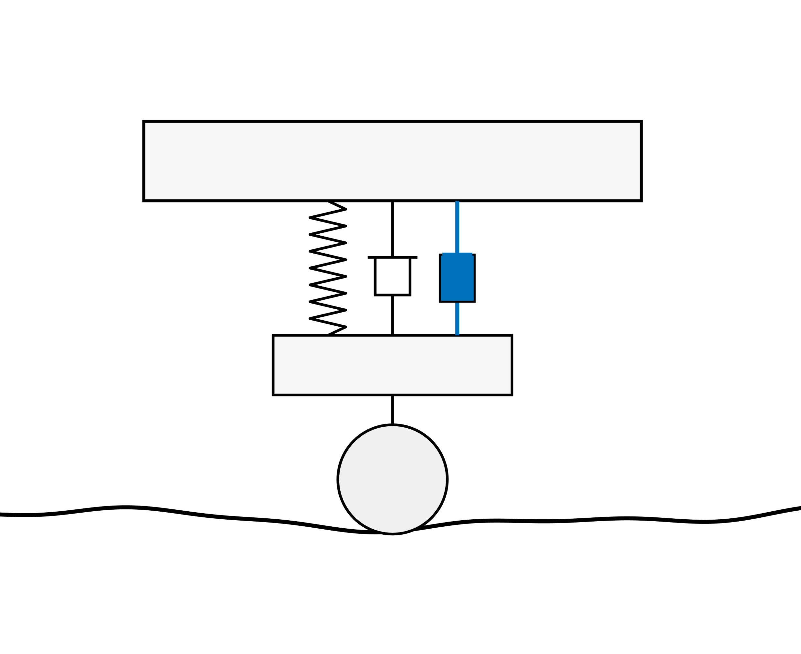
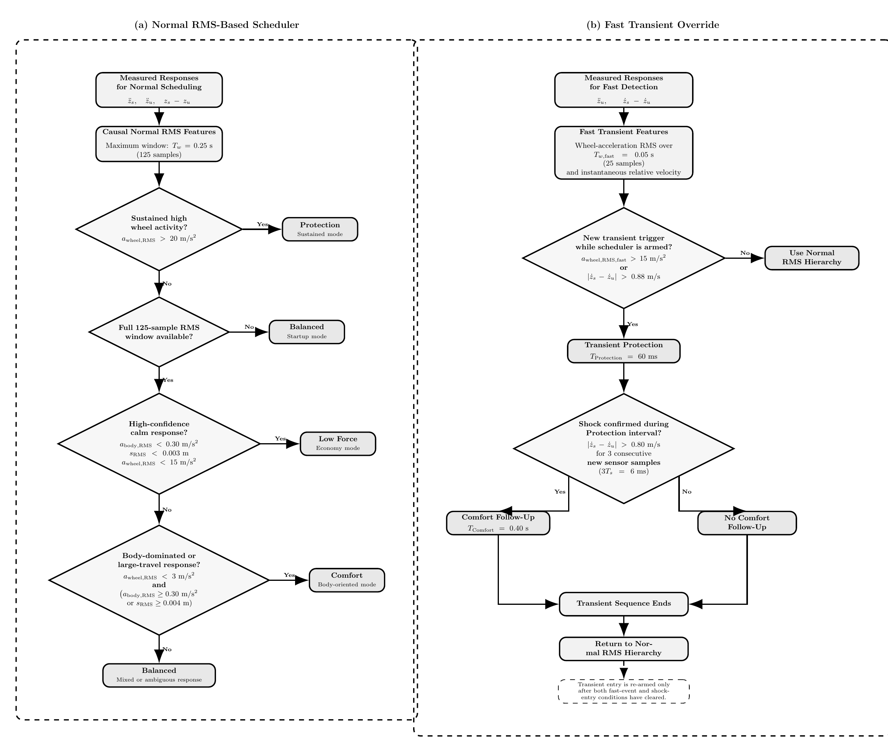

# Sensor-Aware Gain-Scheduled LQR Active Suspension

A MATLAB-based active suspension project developed using a two-degree-of-freedom quarter-car model.

The project progresses from a passive suspension and fixed LQR controller to a response-based gain-scheduled LQR architecture that adapts the control objective according to measured vehicle dynamics rather than prior knowledge of the road profile.

  

  <i>Model 3B response-based active suspension simulation on a composite road profile.</i>

## Control Development

The project was developed progressively through four control stages:

**Model 1 — Passive Suspension**  
A conventional quarter-car suspension model was used to establish the baseline response and illustrate the inherent trade-offs between ride comfort, suspension travel, and tire behavior.

**Model 2 — Fixed LQR Control**  
A fixed Linear Quadratic Regulator was introduced to provide active suspension control. The controller improved body response but retained a single control compromise for all road conditions.

**Model 3A — Manual Gain Scheduling**  
A bank of LQR controllers with different priorities was introduced. Controller selection was manually scheduled according to known road position, demonstrating the potential benefit of changing the control objective with the disturbance condition.

**Model 3B — Response-Based Gain Scheduling**  
The final controller removes the requirement for prior road knowledge. Instead, the active LQR mode is selected online using measured vehicle responses.

  <b>Passive → Fixed LQR → Manual Gain Scheduling → Response-Based Gain Scheduling</b>

## Model 3B Architecture

The response-based scheduler uses:

- sprung-mass acceleration
- unsprung-mass acceleration
- suspension travel
- relative suspension velocity

to select between four LQR controllers: **Balanced**, **Comfort**, **Low Force**, and **Protection**.

The scheduler combines slower RMS-based response classification with a faster transient-detection layer for short disturbance events.

## Scheduling Logic

  

  <i>Hierarchical response-based scheduling logic used in Model 3B.</i>

## Implementation Constraints

To move beyond an idealized controller, the final Model 3B implementation includes:

- actuator force limit: **±750 N**
- actuator force-rate limit: **50,000 N/s**
- sensor sampling frequency: **500 Hz**
- sensor transport delay: **4 ms**
- measurement-noise robustness tests

These constraints were included to evaluate the controller under more realistic implementation conditions rather than under unconstrained ideal actuation and instantaneous measurements.

Add scheduler diagram and implementation constraints

